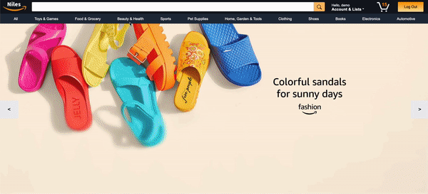

#  - [Niles](https://niles-app-academy.herokuapp.com/#/)  (Amazon Clone)

Nile's, which is the longest river in the world, is a website clone of the company [Amazon](www.amazon.com).  Code implmentation used React, Redux, and Ruby on Rails for the backend. For the database PostgreSQL was used and Amazon AWS for image storage.  In a nutshell, Niles is an e-commerce store where you can view/purchase a variety of products.

## How to use

Niles requires [Ruby](https://www.ruby-lang.org/en/documentation/installation/), [Ruby on Rails 5.2.8](https://gorails.com/setup/osx/10.15-catalina#rails), [Rubygems](https://rubygems.org/pages/download), and npm packages installed on your local machine.  Once Ruby and Ruby on Rails is installed you could also run the command lines below to install the dependencies.

<figure class="highlight"><pre><code class="language-text" data-lang="text">$ bundle install</code></pre></figure>

<figure class="highlight"><pre><code class="language-text" data-lang="text">$ npm install</code></pre></figure>

### Features

<u>Product Filter and Search</u>

