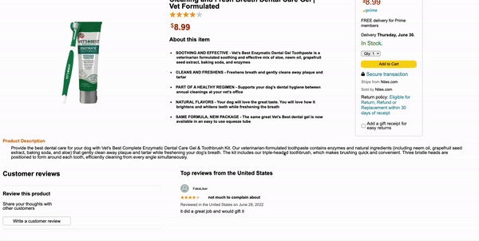

#  - [Niles](https://niles-app-academy.herokuapp.com/#/)  (Amazon Clone)


## Technologies


[Niles](https://niles-app-academy.herokuapp.com/#/) is the longest river in the world and is a website clone of the company [Amazon](www.amazon.com).  

Code implmentation used React, Redux, and Ruby on Rails for the backend. For the database PostgreSQL was used and Amazon AWS for image storage.  In a nutshell, Niles is an e-commerce store where you can view/purchase a variety of products.

## Features
 * New account creation, login, and demo login
 * Product review with full CRUD functionality
 * Shopping Cart with full CRUD functionality
 * Search products

### <b>Highlighted Features</b>

#### <u>Reviews</u>
The items review feature has full CRUD functionality with error handling if a specific portion was missing. A challenge was see if a specific portion of the form was filled out or not for a new or edited form.  This was resolved by using redux state and by checking if the value was truthy or falsy to determine if an error message should be displayed.  The error message was done with a ternary operation. 



```ruby
#Ruby on rails reviews_controller
def update
    @review = Review.find_by(id: params[:id])
    @product = @review.product

    if @review.update(review_params)
        render :show
    else
        render json: @review.erors.full_messages, status: 422
    end
end

private
def review_params
    params.require(:review).permit(:header, :product_id, :rating, :comment)
end
```

#### <u>Cart Items</u>
A challenge was to make sure the cart session was persisting on refresh based on the current user logged in.  The solution was to use the life cycle method componentDidMount to dispatch a requestCart action to the store's reducer to update the current state of the UI.


```javascript
//Redux Cycle
export const fetchCartItems = () => (
    $.ajax({
        method: 'GET',
        url: `api/cart_items`,
    })
)

const receiveCartItems = cartItems => ({
    type: RECEIVE_CART_ITEMS,
    cartItems
})

export const requestCartItems = () => dispatch => (
    cartItemsAPIUtils.fetchCartItems()
        .then(cartItems => dispatch(receiveCartItems(cartItems)))
)

const mDTP = dispatch => ({
    requestCartItems: () => dispatch(requestCartItems())
})

componentDidMount() {
    this.props.requestCartItems()
}
```

#### Future Features
 * Past Order History
 * Add the option to view different photos from a listing
 * Ability to upload pictures and videos to a review